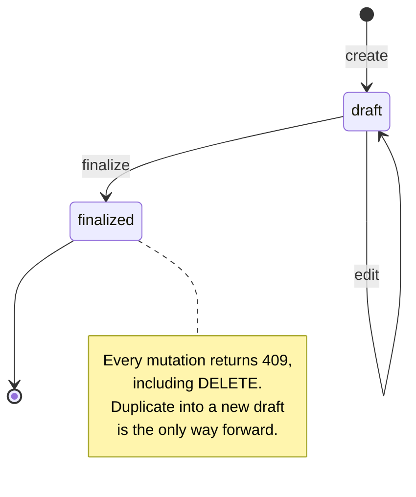

# Multi-Rate Pricing Calculator

Create documents with line items, apply per-line discounts and tax, and view date-range summary reports. All totals are computed **server-side** by a single shared calculation module — the client only previews.

**Live URL:** https://multi-rate-pricing-calculator-serve-psi.vercel.app

**Demo login:** `demo@example.com` / `demo1234` (seeded with the assignment's sample document)

## Features

- Email + password auth (bcrypt + JWT in an httpOnly cookie); strict per-user data isolation
- Documents with line items: quantity, unit price, optional percent **or** fixed discount, optional tax
- Draft → finalized lifecycle; finalized documents are immutable via the API
- Date-range summary report (count, grand total, tax, discount) with an optional finalized-only filter
- Stretch goals — all three: **finalize validation**, **duplicate to draft**, **printable view** (print CSS → browser "Save as PDF")
- 133 automated tests (calculation unit tests, API integration tests, React component tests)

## Stack

| Layer | Choice |
|---|---|
| Backend | Node.js + Express 4 (TypeScript), Prisma 6, PostgreSQL |
| Frontend | React 19 + Vite, shadcn/ui + Tailwind CSS 4, React Router |
| Shared | `shared/` workspace: calculation module, zod schemas, money/date helpers — imported by both sides |
| Testing | Vitest, supertest, React Testing Library |
| Deploy | Vercel (static client + Express as a serverless function), Supabase Postgres |

## Setup

Prerequisites: **Node.js 20+**, **npm**, and a **PostgreSQL** database (a free [Supabase](https://supabase.com) project works; any Postgres does).

```bash
git clone https://github.com/neel-asanulhaquekiron/Multi-rate-Pricing-Calculator.git
cd Multi-rate-Pricing-Calculator
npm install                       # installs all three workspaces

cp server/.env.example server/.env
# edit server/.env: DATABASE_URL, DIRECT_URL, JWT_SECRET (see comments in the file)

(cd server && npx prisma migrate deploy)   # create tables
npm run seed -w server            # demo user + the assignment's sample document

npm run dev -w server             # API on http://localhost:3001
npm run dev -w client             # app on http://localhost:5173 (proxies /api to 3001)
```

Run the tests (unit + API integration + component):

```bash
npm test                          # all workspaces: 79 shared + 48 server + 6 client
```

> The API integration tests run against the database in `server/.env`. They namespace all data they create and delete it afterwards.

There is also an `api.http` file at the repo root — open it with the VS Code *REST Client* extension to click through every endpoint.

## Calculation & rounding policy

### Representation

Money never exists as a float anywhere in the system:

- All amounts are **integer cents**: `100.00` is stored and transmitted as `10000`
- All percents are **integer basis points**: `7.25%` is `725`
- Dollar and percent strings exist only at the UI edge; `shared/src/money.ts` converts in both directions and is unit-tested

### Rounding

Round **half-up to the nearest cent, per line, at each derived step** (discount amount first, then tax amount). The rounding itself is pure integer arithmetic, so floating-point error is impossible even at the boundary:

```
round(amount × bp / 10000)  =  floor((amount × bp + 5000) / 10000)
```

Document totals are plain sums of the rounded per-line results, so this identity holds to the cent:

```
grand total = subtotal − total discount + total tax
```

### Order of operations per line

Implemented once in `shared/src/calc.ts`, used by the server (source of truth) and the client (live preview only):

1. `subtotal = quantity × unit price`
2. Apply the discount: a fixed amount **or** a percent of the subtotal, never both (the discount type is a discriminated union — the combination cannot even be represented)
3. Apply the tax percent **on the discounted amount**
4. `line total = discounted amount + tax`

### Worked example

The assignment's sample document. Inputs:

| Line        | Qty | Unit price | Discount  | Tax |
| ----------- | --- | ---------- | --------- | --- |
| Widget A    | 2   | 100.00     | 10%       | 5%  |
| Widget B    | 1   | 50.00      | none      | 5%  |
| Service fee | 1   | 200.00     | $20 fixed | none |

Per-line results (reproduced exactly by `shared/src/calc.test.ts`, and again through the live API in `server/src/routes/documents.test.ts`):

| Line        | Subtotal | Discount | After discount | Tax  | Line total |
| ----------- | -------- | -------- | -------------- | ---- | ---------- |
| Widget A    | 200.00   | 20.00    | 180.00         | 9.00 | 189.00     |
| Widget B    | 50.00    | 0.00     | 50.00          | 2.50 | 52.50      |
| Service fee | 200.00   | 20.00    | 180.00         | 0.00 | 180.00     |

Document totals:

| Subtotal | Total discount | Total tax | Grand total |
| -------- | -------------- | --------- | ----------- |
| 450.00   | 40.00          | 11.50     | 421.50      |

The grand total checks out both ways: 189.00 + 52.50 + 180.00 = 421.50, and 450.00 - 40.00 + 11.50 = 421.50.

Note Widget A's tax: 5% of **180.00** (the discounted amount), not of 200.00 — discounts always apply before tax.

### Edge policies

- A fixed discount larger than the line subtotal is **rejected** with a specific message (`fixed discount cannot exceed the line subtotal`); the calculation module additionally clamps defensively, so a line can never go negative even if a bug bypassed validation
- Percents accept 0–100 with at most 2 decimal places
- An exact half cent rounds **up**: 5% of \$0.10 = \$0.005 → \$0.01
- To keep every stored amount inside Postgres `Int4`, a single line's subtotal is capped at \$20,000,000 and document totals at ~\$21.4M (`2^31 − 1` cents); both are rejected with specific messages, never silently truncated

## Lifecycle: finalize & immutability



What each status allows:

| Action | Draft | Finalized |
| ------ | :---: | :-------: |
| View / print view | ✅ | ✅ |
| Edit title, customer, issue date | ✅ | ❌ 409 |
| Add / edit / delete lines | ✅ | ❌ 409 |
| Delete the document | ✅ | ❌ 409 |
| Finalize | ✅ | ❌ 409 (double-click safe) |
| Duplicate into a new draft | ✅ | ✅ |

Every rejected mutation returns the same envelope — `409 { code: "DOCUMENT_FINALIZED", message: "finalized documents cannot be modified" }` — enforced in one place (the service layer's draft guard), so no route can forget it.

Two deliberate choices worth calling out:

- **"Read-only" includes undeletable.** A finalized document is a record; letting it be deleted would make "immutable" a half-truth. A real product would add a void/archive flow instead (listed under improvements below).
- **Finalize validation is defense-in-depth (stretch goal).** Finalize re-checks every line for `quantity ≥ 1` and `unit price ≥ 0` straight from the database. Input validation already forbids those states, so this is deliberately the *last gate before immutability* — protection against bugs or manual data edits, not against expected input. Its test proves it honestly: it inserts an invalid row directly via Prisma (bypassing the API) and asserts finalize rejects it with a message naming the offending line.

## Duplicate semantics (stretch)

`POST /api/documents/:id/duplicate` works on **any** status (drafts too — the spec asks for finalized; allowing drafts is simpler and useful for templating):

- Creates a fresh **draft** with all lines copied in order and identical totals
- Title gets a ` (copy)` suffix
- Issue date is supplied by the client — the browser's local "today", because the server's clock lives in a different timezone than the user
- The source document is never touched

## Summary report semantics

`GET /api/reports/summary?from=YYYY-MM-DD&to=YYYY-MM-DD` returns document count, grand total, tax, and discount sums for the authenticated user, where:

- **All documents count by default** — drafts included (the literal reading of the spec); an optional `status=finalized` query parameter (the "Finalized only" toggle in the UI) restricts the summary to finalized documents
- Filtering is on **issue date**, boundaries **inclusive**
- `from > to` is rejected with a specific message
- The report reads totals persisted on each document (recomputed inside the same transaction as every line mutation), so it is one SQL aggregate — and an integration test asserts the report exactly equals the sum of the individual document responses, including after edits.

## API reference

All endpoints are JSON under `/api`. Authenticated routes read the session from an httpOnly cookie. Errors share one envelope: `{ code, message, details? }` with specific, human-readable messages.

| Method | Path | Notes |
|---|---|---|
| POST | `/api/auth/signup` | email + password (min 8); auto-login |
| POST | `/api/auth/login` | constant-shape 401 (no account enumeration) |
| POST | `/api/auth/logout` | clears the cookie |
| GET | `/api/auth/me` | current user |
| GET | `/api/documents` | own documents, newest first |
| POST | `/api/documents` | title, customer, issueDate |
| GET | `/api/documents/:id` | with lines (stable order) + totals |
| PUT | `/api/documents/:id` | metadata; drafts only |
| DELETE | `/api/documents/:id` | drafts only (finalized → 409) |
| POST | `/api/documents/:id/lines` | add line; recomputes totals transactionally |
| PUT | `/api/documents/:id/lines/:lineId` | edit line; drafts only |
| DELETE | `/api/documents/:id/lines/:lineId` | remove line; drafts only |
| POST | `/api/documents/:id/finalize` | one-way; validates lines |
| POST | `/api/documents/:id/duplicate` | any status → new draft |
| GET | `/api/reports/summary?from=&to=&status=` | date-range aggregate; `status=finalized` optional |
| GET | `/api/health` | liveness + real DB read |

Ownership is enforced in the service layer: every query is scoped by the authenticated user id, so another user's document simply **404s** — the API never reveals that it exists.

## Architecture notes

- **npm workspaces monorepo**: `shared/` (calc, validation, money/date helpers), `server/` (Express API), `client/` (React SPA). The shared workspace is what guarantees "single calculation module": the server computes and persists with it, the client uses the same functions for its live *preview* (clearly labeled; the server's response always overwrites).
- **Server is the source of truth**: every mutation returns the full document; the client replaces its state with the response and never promotes its own math.
- **Date-only discipline**: issue dates are `YYYY-MM-DD` strings in the API, zod, and React state; only the Prisma boundary converts to `DATE`, in UTC. This kills the classic off-by-one-day timezone bug, and impossible dates like `2026-02-30` are rejected rather than silently wrapped.
- **One error converter**: routes and services throw typed errors; a single Express middleware maps them (and zod issues) to the response envelope. Unknown errors become a safe 500 — no stack traces leak.
- **Deployment**: one Vercel project serves the static client build and wraps the Express app as a serverless function; Postgres connections go through Supabase's transaction pooler (`pgbouncer=true`, one connection per lambda). A daily cron pings `/api/health` (which performs a real `SELECT 1`) so the free-tier database never pauses.

## Testing

| Suite | What it covers |
|---|---|
| `shared` (79) | Exhaustive calc unit tests — the sample document to the cent, 0%/100%, fixed=subtotal, clamping, half-cent rounding, Int-safety; money/percent/date parsing both directions |
| `server` (48) | API integration against a real database: auth flows and specific validation messages, cross-user isolation, the sample document through the API, recompute on edit/delete, the full finalized-409 matrix, defense-in-depth finalize, duplicate semantics, report boundaries + consistency + the finalized-only filter |
| `client` (6) | Component tests: the discount payload can never contain both percent and fixed, money input round-trip, server 409 rendered in the error banner, finalized documents render with zero inputs, a mid-session 401 lands on the login page |

## Assumptions & tradeoffs

- **Reports include drafts by default** — the spec says "number of documents" without qualification, so the literal reading is the default; a finalized-only view is available as an explicit opt-in (the `status=finalized` parameter / UI toggle) rather than a silent reinterpretation of the spec.
- **Finalized documents cannot be deleted** — "read-only" taken at full strength; documents are records once finalized.
- **Empty documents may be finalized** — the spec's finalize validation only names quantity/price rules; rejecting empty documents would be an invented rule.
- **Duplicating a draft is allowed** — the spec only requires finalized → draft; allowing both is simpler and strictly more useful.
- **Single currency** (dollars) per the spec's examples.
- **Amount caps** (Int4) documented above rather than unbounded `BigInt` — right-sized for a quoting tool, rejected loudly at the boundary.
- **Tests hit a real database** rather than mocks — slower, but they prove the actual transactional recompute and constraint behavior; data is namespaced and cleaned per run.

## What I'd improve before production

- Rate limiting + login attempt lockout; password reset and email verification
- CSRF token (currently mitigated by `SameSite=Lax` + the JSON content type)
- Refresh-token session rotation instead of a single 7-day JWT
- Void/archive flow for finalized documents (they're currently permanent)
- Pagination on the document list and report drill-down (per-document rows)
- Audit trail of document changes; soft deletes
- CI pipeline (tests + typecheck gating deploys) and a separate test database
- Observability: structured logs, error tracking, uptime alerts on `/api/health`
